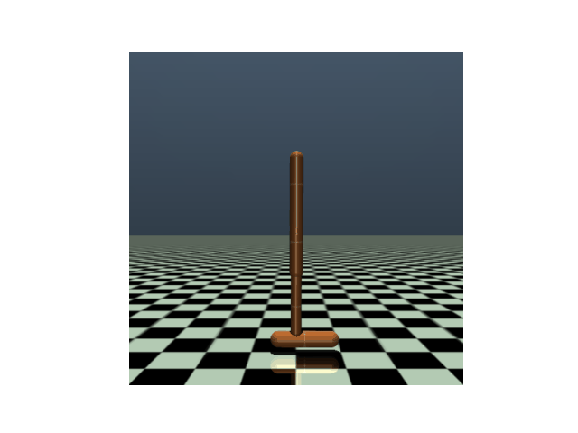

# IRL TRAINING
Trained an expert first on the Hopper-v5 env from the gymnasium library, from which when then generated rollouts for the other policies to learn thorugh imitation. 

Trained on both GAIL and BehaviourCloning methods.

## GAIL 
Sample video 

TOTAL REWARD: 170 

## Behaviour Cloning
Sample video

TOTAL REWARD: 630

As you can see Behaviour Cloning performed much better than GAIL. There can be plenty of reason for this:
1. As the environment wasnt that complex so a simpler method just learned better 
2. In GAIL we had to train a discriminator and a policy, and the method is way more complex and there's lot of nuances involved and hyperparameter tuning which can affect the training.

### USAGE
1. Install the requirement first using `pip install -r requirements.txt`
2. gail.py file constains the training script for GAIL and behaviorC.py for Behaviour Cloning 
3. Theres play_test.py which created the demo gif for the trained polices 
4. test_bc.py and test.py are simple for evaluating the polices  
